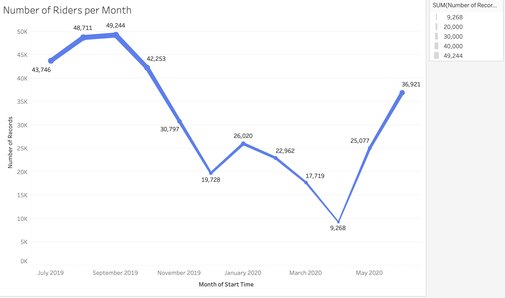
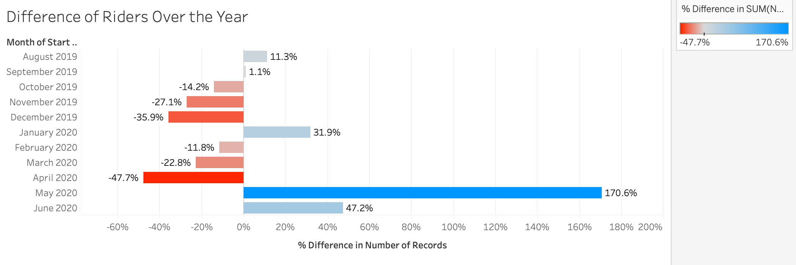
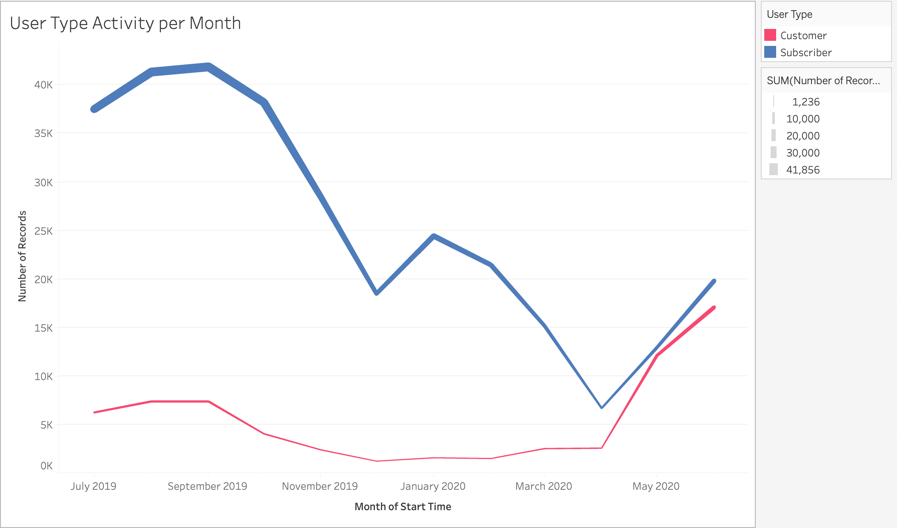
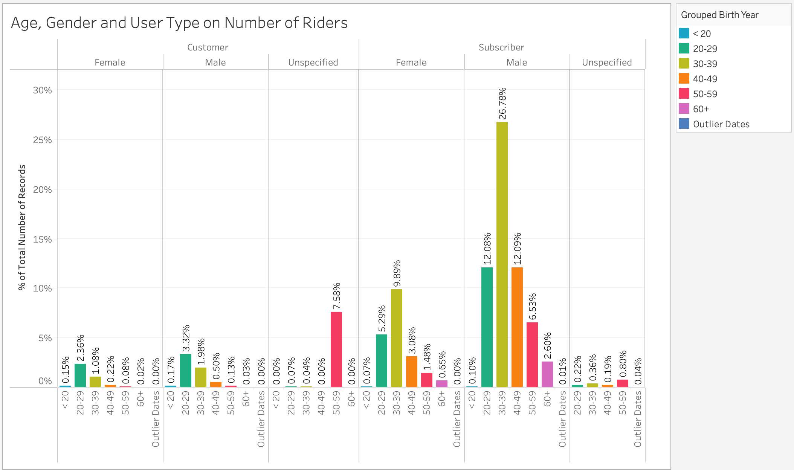
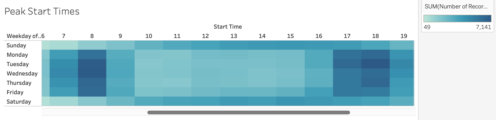
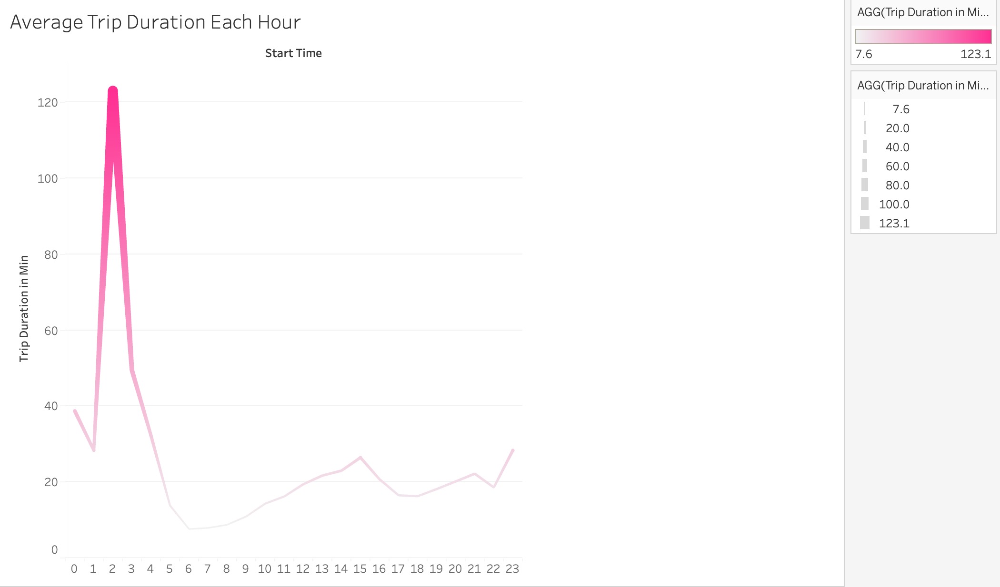
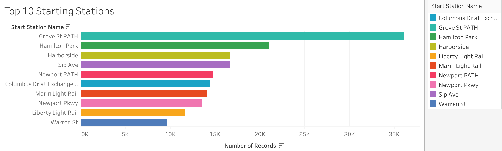
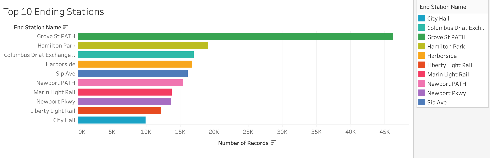
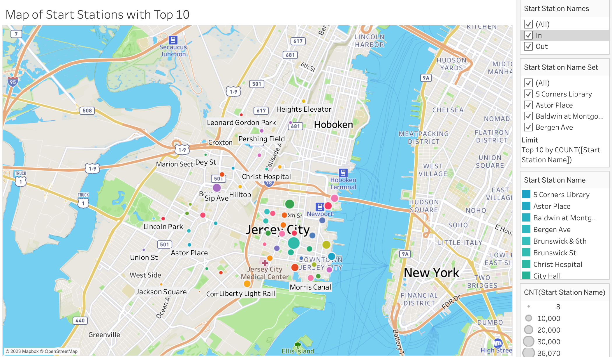

# Citi-Bike-Analysis

Table of Contents
=================

  * [Background](#background)
  * [Objective](#objective)
  * [Deployment of Visualizations](#deployment-of-visualizations)
  * [Analysis](#analysis)
  * [References](#references)

## Background

As a new lead analyst for the New York Citi Bike program, there was responsiblity for overseeing the largest bike-sharing program in the United States. City officials expected the generation of regular reports to publicize and improve the city program. 

Since 2013, the Citi Bike program has implemented a robust infrastructure for collecting data on the program's utilization. Each month, bike data is collected, organized and made public on the Citi Bike Data webpage. 

## Objective

Although data has been regularly updated, the team has not implemented a dashboard or sophisticated reporting process. The first task is to build a set of data reports to provide the answers.

## Deployment of Visualizations

Please view the visuzliations on Tableau here: https://public.tableau.com/app/profile/tiara.mardosas/viz/citi_bike_analysis_16834732350390/CitiBikeDashboard1

## Analysis

**1. Number of Records**
In this dataset, there were a total of 372,446 records. The total number of riders peak nearing 50,000 in the month of September 2019. The lowest number of riders was in April 2020 of nearing a low of 9,000 rides. In accordance with the seasons, there is a trend for more riders during spring and summer, where there begins to be a decline in the winter months. 
   

  

This similarity in the increase and decrease of riders due to the season is also depicted when looking at user type, specifically 'Subscribers'. We seem to see a similar graph as the overall records. Interestingly, the 'Customer' user type was fairly flat in the summer of 2019, with an increase in May 2020. This may be attributed to the recent global pandemic and a normalization of life in 2020. 
 

**2. Rider Demographics**
Males are noted to account for the largest total number of riders overall. Specifically, males between the ages of 30-39 who are subscribers.

Females between the ages 30-39 are noted to be the largest total number of riders for the gender. As well, these females are subscribers. 
 

**3. Common Times**
Peak start and stop times are during 07:00-08:00 and 17:00-18:00 for the riders. This is likely attributed to the standardized workday. 
 

Average trip times were generally below 20 minutes in duration, however, there is a spike noted at 02:00 of trips being nearly 2 hours. The spike may be attributed to the population of individuals riding at that time.
 

**4. Mapped Stations**
The top start and stop stations are Grove St. PATH and Hamilton Park. 
 

 

 

## References 

Citi Bike NYC (2023). System Data. https://citibikenyc.com/system-data. Contains public data provided according to the NYCBS Data Use Policy.

* Dataset provided by edX UofT Data Analytics, which had been generated by Trilogy Education Services, LLC. 

- - -
